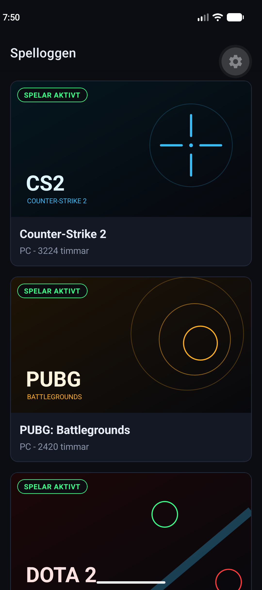
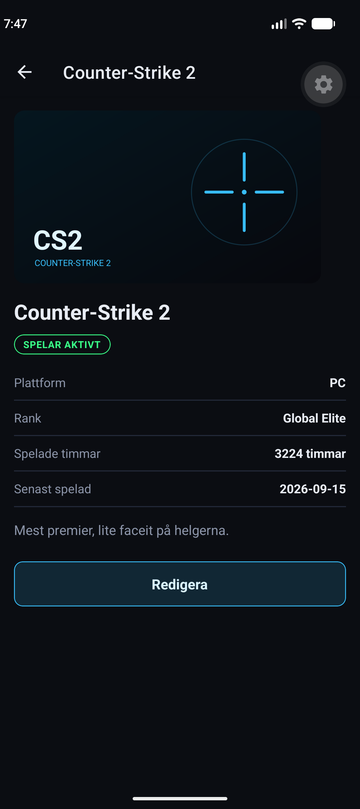
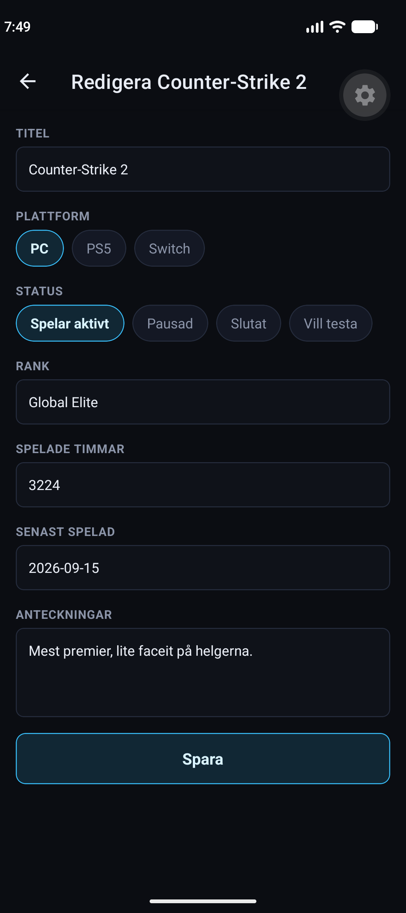

# Spelloggen mobile

The phone version of Spelloggen, my list of the games I play. It shows the same games as the web
app, because both talk to the same backend. You can open a game to see everything about it, and
change it from the phone.

Made with React Native and Expo.

The other two repos:

- Backend: https://github.com/ThanosMakedas/spelloggen-api
- Web app: https://github.com/ThanosMakedas/spelloggen-web

## What it looks like





## Before you start

| Needed | Why |
|---|---|
| .NET 10 SDK | to run the backend |
| Node.js 20.19 or later, or 22.12 or later | to run this app |
| Android Studio with an emulator, or a phone with Expo Go | to see the app |

## 1. Start the backend

The app shows nothing without it. In its own terminal:

```
git clone https://github.com/ThanosMakedas/spelloggen-api.git
cd spelloggen-api
dotnet run --launch-profile lan
```

`--launch-profile lan` is the important part. Without it the API only answers on the computer
itself, and the phone or the emulator cannot reach it. Windows asks once whether to allow it
through the firewall, answer yes for the private network.

## 2. Start the app

In a second terminal:

```
git clone https://github.com/ThanosMakedas/spelloggen-mobile.git
cd spelloggen-mobile
npm install
npx expo start
```

Then choose one of these two:

**On an Android emulator:** start the emulator from Android Studio first, then press `a` in the
terminal. Expo installs Expo Go in the emulator by itself the first time.

**On your own phone:** install Expo Go from the store, put the phone on the same Wi-Fi as the
computer, and scan the QR code that the terminal shows. On Android scan it from inside Expo Go,
on iPhone scan it with the camera app.

**On an iPhone there is one extra step.** Since Expo SDK 57, Expo Go only opens a project when
the computer and the app are signed in to the same Expo account. Run `npx expo login` in the
terminal, and sign in inside Expo Go by tapping the avatar in the top right corner. An account is
free. On Android this is not needed.

## What you can do

- See all the games in a list, with the cover image and the status
- Tap a game to open it and see platform, rank, hours, date and notes
- Press **Redigera** to change a game and save it back to the API
- If the API is not running, the app says so and offers a **Försök igen** button

## Why I built it this way

**Expo instead of plain React Native.** With Expo the app runs on a real phone by scanning a QR
code, with nothing else installed. Plain React Native would need Android Studio and Java set up
before the first line of code.

**A stack navigator with three screens.** A stack works like a pile of paper: the list is at the
bottom, and the game and the edit form are placed on top. The back button and the swipe back come
with it, so there is nothing to write for that.

**The app finds the API by itself.** The phone cannot use `localhost`, since that would mean the
phone. Expo knows the computer's address, because the app is loaded from there, so `api.js` takes
that address and adds the port of the API. On an Android emulator the computer is called
`10.0.2.2`, and that case is handled too. Nobody has to edit a file to run this on another
computer.

**One file for all the calls, `api.js`.** The address and the error messages live in one place,
so the screens only deal with what they show.

**No extra libraries for the design.** The colors are written in the components, in the same dark
and neon style as the web app, so the two feel like one product.

**No create and no delete here.** The phone app is for looking at the list and correcting it, for
example after an evening of gaming. Adding and removing games is done in the web app.

## The files

```
App.js                      the three screens of the stack
api.js                      every call to the API
components/StatusBadge.js   the status, with its own color
components/Felmeddelande.js the error message with a retry button
screens/ListaSkarm.js       the list
screens/DetaljSkarm.js      one game
screens/RedigeraSkarm.js    the edit form
```
